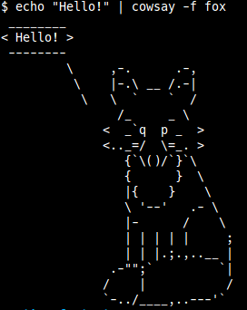
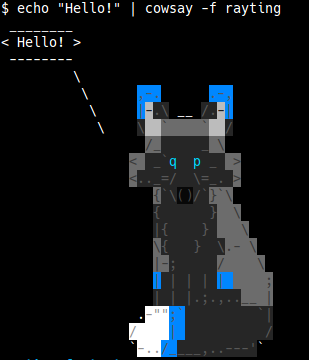

Foxsay
==============================

Fox cowfiles to extend your cowsay library of animals and friends to include foxes.

## Usage

Install and test:
```bash
sudo cp $cowsay_file /usr/share/cowsay/cows/
echo "Hello!" | cowsay -f $cowsay_file
```

## Cowfiles

### Fox

Simple ASCII fox in sitting position.



### Rayting

Colored version of the fox named Rayting with silver fox fur pattern and blue accents.

Color is added with ANSI 256 color codes [(Wikipedia reference)](https://en.wikipedia.org/wiki/ANSI_escape_code#Colors) 


